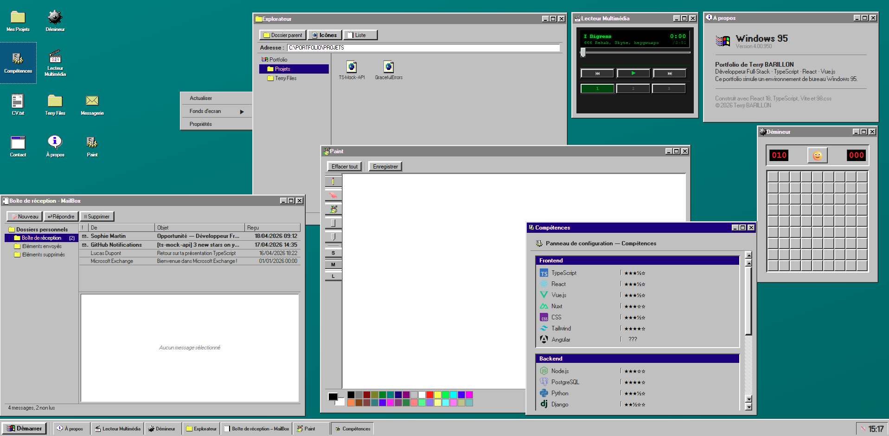

# Portfolio Windows 95

Interactive portfolio presented as a Windows 95 desktop. The app simulates a retro environment with a boot screen, desktop, taskbar, resizable windows, and several internal applications.

## Preview



## Features

- Full Windows 95 desktop with draggable icons and background themes.
- Application windows managed by a central store, with minimize, maximize, and layering behavior.
- Simulated startup and shutdown through a boot screen and the taskbar.
- File explorer for browsing projects and virtual folders.
- Built-in applications: projects, skills, resume, contact, about, mail, Paint, media player, Minesweeper, and a film gallery.
- Local persistence for certain states such as icon positions and the desktop theme.

## Tech Stack

- React 19
- TypeScript
- Vite
- Zustand
- 98.css
- Howler
- Motion

## Installation

```bash
pnpm install
```

## Development

```bash
pnpm dev
```

Then open the app locally with Vite.

## Available Scripts

```bash
pnpm dev
pnpm build
pnpm lint
pnpm preview
```

## Main Structure

- `src/App.tsx`: orchestration of the boot screen, desktop, and windows.
- `src/components/Desktop/`: desktop, icons, and theme management.
- `src/components/Taskbar/`: taskbar and Start menu.
- `src/components/apps/`: portfolio applications.
- `src/data/`: virtual content, projects, mails, skills, and icons.
- `src/store/windowStore.ts`: open window state.